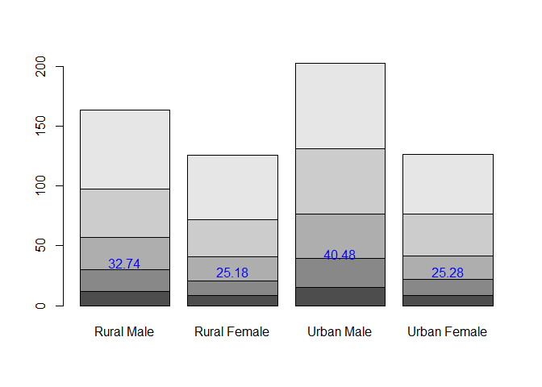
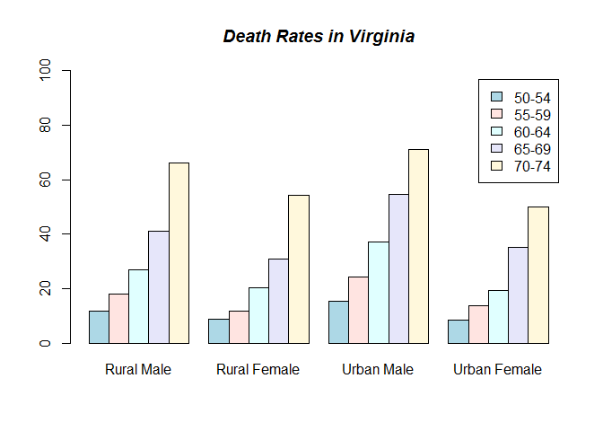

# Virginia

## In this example we use the R data set 'VADeaths' to examine death rates per 1000 in Virigina in 1940. The data set has variables age group, rural male, rural female, urban male, urban female.

## The first plot is a column plot of deaths for each type of individual (the columns) by age group (shading on the columns). The height of the shading represents the death rate. The number in each column is the total death rate for that column. 

## The second chart is a clustered bar chart where each cluster represents a type of individual (rural male, rural female, etc) and the bars represent the age group. The death rate is given by the height of the bar.


```r
mp <- barplot(VADeaths) # default
tot <- colMeans(VADeaths)
text(mp, tot + 3, format(tot), xpd = TRUE, col = "blue")
```

 

```r
barplot(VADeaths, beside = TRUE,
        col = c("lightblue", "mistyrose", "lightcyan",
                "lavender", "cornsilk"),
        legend = rownames(VADeaths), ylim = c(0, 100))
title(main = "Death Rates in Virginia", font.main = 4)
```

 

## If I were doing a project to turn in, I would add some data interpretation here.
